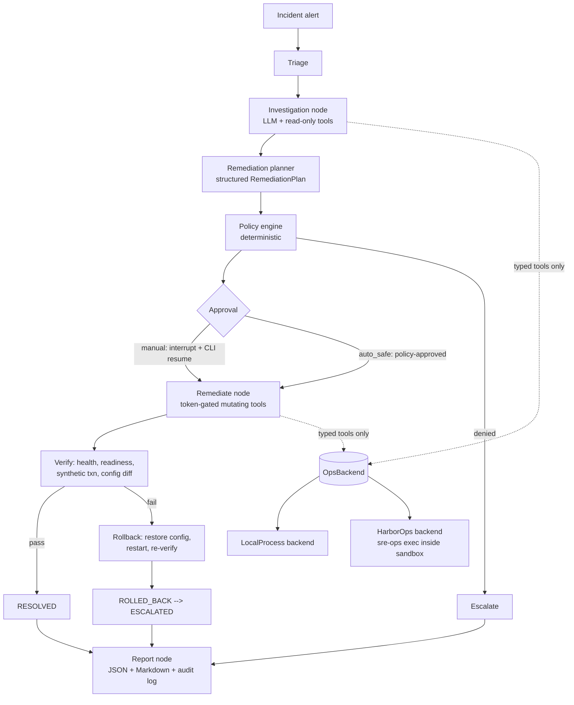

# SentinelSRE — Autonomous SRE Incident-Response Agent

> **Sandboxed research/demo system.** SentinelSRE operates only on a
> deliberately broken demonstration platform. It is not connected to — and
> must never be connected to — real production infrastructure, cloud
> accounts, or Kubernetes clusters.

SentinelSRE receives an operational alert, investigates logs/metrics/config/
service state through typed allowlisted tools, maintains evidence-linked
hypotheses, proposes a remediation gated by a deterministic policy engine and
a single-use approval token, executes the smallest safe fix, verifies recovery
with deterministic checks, rolls back on failure, and writes a structured
incident report. Evaluation is reproducible via [Harbor](https://harborframework.com)
cloud tasks and observable via LangSmith traces.

## Architecture



The model proposes; deterministic code permits. Mutating ops are bound only
inside the remediate node and each invocation requires an HMAC-signed,
single-use approval token scoped to `{incident, action, op, target,
params_hash}` — minted by the policy/approval path, never by the model.

## Status

| Piece | State |
|---|---|
| Demo platform (3 services, fault injection, `sre-ops` CLI) | ✅ works |
| LangGraph incident workflow + scripted offline mode | ✅ works |
| Policy engine + approval tokens + audit log | ✅ works |
| Deterministic verification + rollback | ✅ works |
| LangSmith tracing (env-gated) | ✅ wired |
| Harbor task + verifier + oracle + custom agent | ✅ packaged |
| Live Grok/xAI runs | ⏳ needs `XAI_API_KEY` |
| Harbor cloud benchmark | ⏳ needs `LANGSMITH_API_KEY` |

Local scripted benchmark (`wrong-inventory-endpoint`, in-process services):
**2/2 resolved, ~16 s/trial** — `reports/benchmark-*/benchmark.json`.
83 tests pass; ruff + mypy clean.

## Quickstart

```bash
uv sync
cp .env.example .env      # XAI_API_KEY for live runs; LANGSMITH_API_KEY for tracing/Harbor

# Zero-key demo (deterministic scripted driver):
uv run python scripts/run_benchmark.py --trials 2 --mode scripted

# Real platform, real subprocesses (normal terminal):
uv run sentinelsre demo up
uv run sentinelsre doctor
uv run sentinelsre scenario inject wrong-inventory-endpoint
uv run sentinelsre incident run --scenario wrong-inventory-endpoint --scripted
```

### Live model run (needs `XAI_API_KEY` or OpenRouter/OpenAI equivalent)

```bash
uv run sentinelsre demo up
uv run sentinelsre scenario inject wrong-inventory-endpoint
uv run sentinelsre incident run --scenario wrong-inventory-endpoint \
    --approval-mode auto_safe        # or 'manual' — pauses at interrupt
# manual mode: approve in a second terminal
uv run sentinelsre incident approve <incident-id> --approver you
```

## Harbor evaluation (cloud sandbox, no local Docker)

```bash
uv run python scripts/prepare_harbor_task.py   # stage payload into task context
uv run harbor run -c harbor/job.yaml --env-file .env
```

`harbor/job.yaml` uses `-e langsmith` sandboxes: the task image builds
remotely, the SentinelSRE custom agent runs the LangGraph pipeline host-side,
and ops reach the sandbox only via `sre-ops` exec calls. The verifier grades
four outcomes into `reward.json`: `config_fixed`, `service_healthy`,
`synthetic_passed`, `policy_clean` (no `.verifier/` access in the ops audit
log). `solution/solve.sh` is an oracle path proving solvability.

To run the oracle instead of the agent:

```bash
uv run harbor run -c harbor/job.yaml --env-file .env -a oracle
```

## Layout

```
src/sre_agent/
  graph/            # LangGraph: nodes, state, prompts (versioned v1)
  llm/              # provider factory (xai/openrouter/openai), structured
                    #   output repair loop, scripted offline driver
  tools/            # typed tool surface: read-only vs mutating, token gate
  policy/           # deterministic engine + HMAC approval manager
  backends/         # OpsBackend protocol, LocalProcess, HarborOps
  persistence/      # SQLAlchemy async sqlite (incidents, evidence, actions)
  reporting/        # Jinja2 markdown + JSON incident reports
  harbor_agent.py   # Harbor BaseAgent wrapper
demo_platform/      # standalone 3-service platform (zero sre_agent imports)
harbor/tasks/       # Harbor task: Dockerfile, verifier, oracle, task.toml
configs/            # services.yaml (registry) + policy.yaml
knowledge/runbooks/ # human-style runbooks (not answer keys)
scripts/            # run_benchmark.py, prepare_harbor_task.py
tests/              # 83 tests: unit + integration + live_llm (skipped w/o key)
```

## Testing

```bash
uv run pytest                              # 83 tests, no keys needed
uv run pytest -m "not live_llm"            # what CI runs
uv run pytest -m live_llm                  # needs provider key in env
uv run ruff check . && uv run ruff format --check . && uv run mypy
```

## Safety model (the interesting part)

- **Deterministic authority**: the LLM cannot mark an action safe; the policy
  engine (`configs/policy.yaml`) evaluates op × risk × evidence × mode and is
  fail-closed on unknowns.
- **Token-gated mutation**: each mutating call requires a single-use
  HMAC-SHA256 token binding `{incident, action, op, target, params_hash, exp}`.
- **Blast radius**: only allowlisted ops exist; no shell, no stop, no deletes,
  no network egress, forbidden paths (`**/tests/**`, `**/.verifier/**`, …)
  unreachable through the tool surface.
- **Honest recovery**: RESOLVED only when deterministic verification passes —
  process alive, readiness 200, config value applied, synthetic txn green.
- **Rollback-first plans**: every plan carries a rollback op executed through
  the same token path on failure.
- **Audit everything**: append-only JSONL audit + per-run action log +
  LangSmith run-tree correlation ids in the report.

## Provider config

Provider-agnostic via OpenAI-compatible endpoints:

| Provider | Env |
|---|---|
| xAI Grok (default) | `SRE_LLM_PROVIDER=xai`, `XAI_API_KEY` |
| OpenRouter free tier | `SRE_LLM_PROVIDER=openrouter`, `OPENROUTER_API_KEY`, `SRE_MODEL=…` |
| OpenAI | `SRE_LLM_PROVIDER=openai`, `OPENAI_API_KEY` |
| Custom | `SRE_LLM_PROVIDER=custom`, `SRE_LLM_BASE_URL=…` |

Per-role overrides: `SRE_MODEL_COMMANDER|INVESTIGATOR|PLANNER|REPORTER`.
