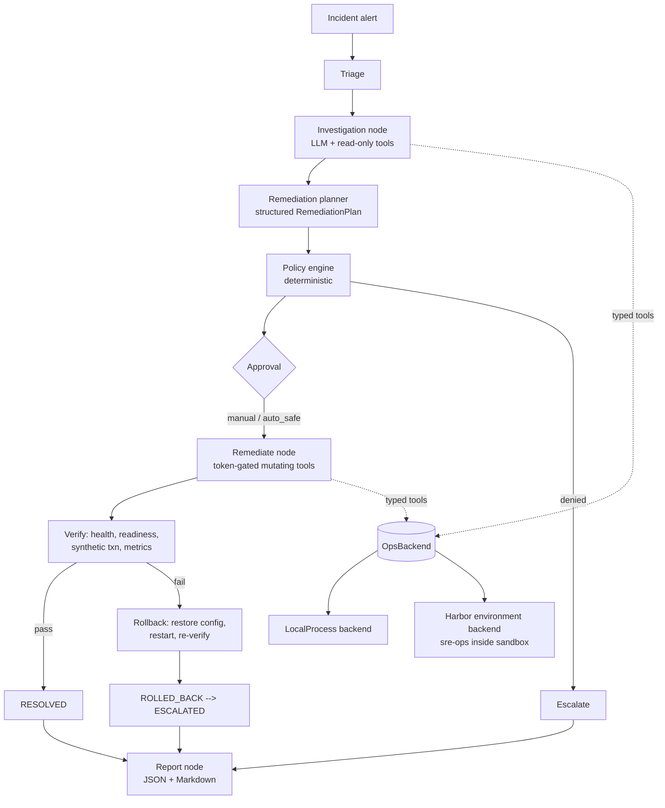

# SentinelSRE — Autonomous SRE Incident-Response Agent

> **Sandboxed research/demo system.** SentinelSRE operates only on a
> deliberately broken demonstration platform. It is not connected to — and
> must never be connected to — real production infrastructure, cloud
> accounts, or Kubernetes clusters.

SentinelSRE receives an operational alert, investigates logs/metrics/config/
service state through typed allowlisted tools, maintains evidence-linked
hypotheses, proposes a remediation gated by a deterministic policy engine and
an approval token, executes the smallest safe fix, verifies recovery with
deterministic checks, rolls back on failure, and writes a structured incident
report. Evaluation is reproducible via [Harbor](https://www.harborframework.com)
tasks and observable via LangSmith traces.

## Architecture



## Status

🚧 Under construction — see `PROJECT_PLAN.md` for the build phases.
Honest-status rule: nothing here claims to work until it has been executed.

## Quickstart (once Phase 1+ lands)

```bash
uv sync --all-extras
cp .env.example .env   # fill in XAI_API_KEY (or OpenRouter/OpenAI), LANGSMITH_API_KEY
uv run sentinelsre demo up
uv run sentinelsre doctor
uv run sentinelsre scenario inject wrong-inventory-endpoint
uv run sentinelsre incident run --scenario wrong-inventory-endpoint
uv run sentinelsre report show INC-1001
```

## Testing

```bash
uv run pytest                      # unit + integration (no API keys needed)
uv run ruff check . && uv run mypy src
```

Live-LLM tests are gated: `RUN_LIVE_LLM_TESTS=true uv run pytest -m live_llm`.
