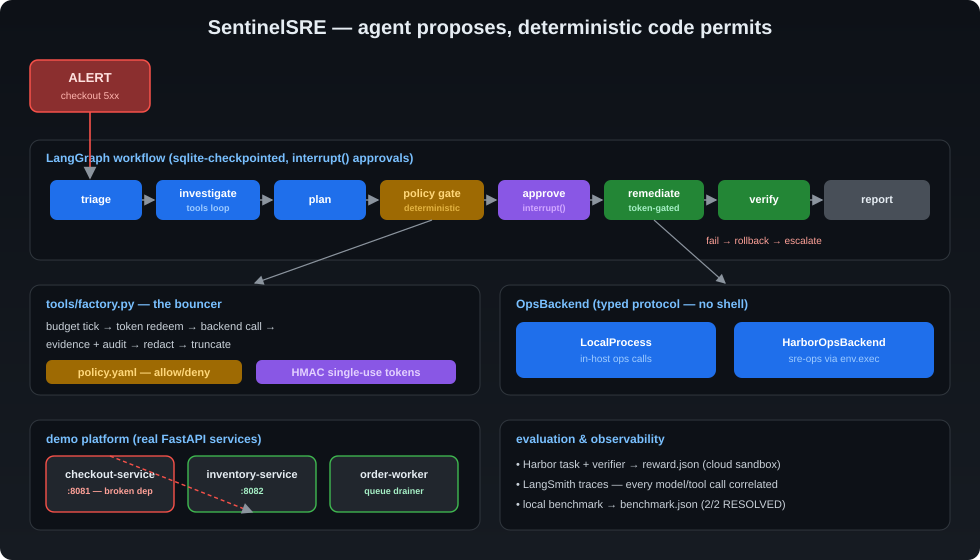
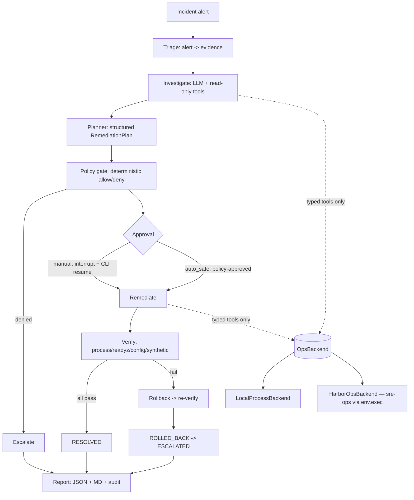

# SentinelSRE — Autonomous SRE Incident-Response Agent


> **Sandboxed research/demo system.** SentinelSRE operates only on a
> deliberately broken demonstration platform. It is not connected to — and
> must never be connected to — real production infrastructure, cloud
> accounts, or Kubernetes clusters.

SentinelSRE is an AI agent that does what a human Site Reliability Engineer
does when paged at 3 AM: it receives an alert, investigates the system like a
detective (logs, metrics, config, dependencies, runbooks), forms evidence-linked
hypotheses with confidence scores, proposes the smallest safe fix, passes it
through a deterministic policy engine and an approval gate, executes through
single-use tokens, verifies recovery with real checks (not "the model said
so"), rolls back if it failed, escalates to a human when unsure, and writes a
full incident report — all of it auditable, reproducible, and evaluable.

**The thesis of this project**: the AI proposes; deterministic code permits.
The model is never trusted with raw power — it gets typed tools, a policy
gate it cannot influence, and one-time cryptographic tickets for mutations.

<p align="center">
  
</p>

## Measured results (not claims — executed runs)

| Metric | Result |
|---|---|
| Test suite | **83 passing** (unit + integration), 1 skipped (live-LLM gate) |
| Static gates | `ruff` + `mypy` clean across 49 source files |
| Scripted benchmark | **2/2 trials RESOLVED**, ~16 s/trial, zero API keys |
| Live Grok 4.3 run | **RESOLVED end-to-end** — investigate → plan → policy → token-gated patch → reload → verified → report, ~90 s wall clock |
| Harbor cloud eval (LangSmith sandbox) | **reward = 1.0** — `config_fixed`, `service_healthy`, `synthetic_passed`, `policy_clean` all 1.0, trial ≈1m41s, zero exceptions |
| Safety evidence | plan denied + escalated correctly when the model cited fabricated evidence IDs; hallucinated config hash rejected by optimistic-concurrency gate |
| Evaluation | Harbor task + independent verifier (`reward.json`), oracle solution, LangSmith run-tree correlation |

---

## Table of contents

- [Why this project exists](#why-this-project-exists)
- [The demo world it operates in](#the-demo-world-it-operates-in)
- [Architecture — how a run flows](#architecture--how-a-run-flows)
- [The safety model](#the-safety-model)
- [Repository map — what every file does](#repository-map--what-every-file-does)
- [How it was built — phases 0–6](#how-it-was-built--phases-06)
- [Running it — every mode](#running-it--every-mode)
- [Keys and costs](#keys-and-costs)
- [Evaluation](#evaluation)
- [Engineering practices](#engineering-practices)

---

## Why this project exists

Target roles: **AI agents engineering / agentic harness engineering /
AI-agents software engineering**. A résumé project is only credible if it
demonstrates the hard parts: orchestration, structured model outputs, safe
tool use, deterministic policy enforcement, human-in-the-loop approvals,
evidence grounding, rollback, verification, reporting, auditability, offline
reproducibility, and a real evaluation pipeline. SentinelSRE exercises *all*
of those against a live microservice environment — not a mock.

## The demo world it operates in

A mini e-commerce platform made of real services (not simulations):

| Service | Port | Role |
|---|---|---|
| `checkout-service` | 8081 | FastAPI app; accepts orders, calls inventory |
| `inventory-service` | 8082 | FastAPI app; stock lookups |
| `order-worker` | — | Background loop draining a file-backed queue |

They read runtime config from `runtime/config/*.json`, write JSONL logs to
`runtime/logs/`, expose `/health` and `/readyz`, and emit a synthetic
`checkout` transaction used as the end-to-end probe.

The **scenario** `wrong-inventory-endpoint` corrupts `checkout-service`'s
config — `inventory_url` gets pointed at a dead port — so every checkout
fails with HTTP 503. The platform also writes hidden *ground truth* to
`runtime/.verifier/` (inaccessible to agent tools) so an external grader can
score the outcome honestly.

The agent's only window into this world is **`sre-ops`**
(`python -m demo_platform.ops_cli.cli`), a typed ops CLI: `services list`,
`service status|start|stop|restart|reload`, `logs read|large|rotate`,
`metrics get`, `deps status`, `config read|hash|patch|restore`,
`check health|synthetic`, `disk usage`, `runbooks search`, `platform up|down`.
Everything is JSON in / JSON out, allowlisted, and audited.

## Architecture — how a run flows



The workflow is a **LangGraph `StateGraph`** — the incident lifecycle itself
is the graph. Nodes: `triage → investigate → plan → policy_gate →
approve → remediate → verify → {resolve, rollback, escalate} → report`.

- **Investigate** binds only *read-only* tools to the model. The LLM loops
  (model → tool → model) under a turn/tool budget, then must emit a
  structured `InvestigationResult` — hypotheses with real evidence IDs,
  a candidate root cause, and a confidence score.
- **Plan** forces a structured `RemediationPlan`: operation, target,
  parameters, risk, expected effect, verification steps, and a rollback op.
  Invalid structured output gets repaired in a bounded loop — a malformed
  plan can never reach execution.
- **Policy gate** is pure code (`configs/policy.yaml`): op allowlists, risk
  tiers, evidence minimums, scenario overrides, forbidden paths. Fail-closed.
- **Approve** uses LangGraph `interrupt()` in manual mode — the run pauses
  mid-graph, state checkpoints to SQLite, and `sentinelsre incident approve`
  resumes it. In `auto_safe` mode the policy auto-issues tokens.
- **Remediate** binds only the *approved* mutating tools — the model can't
  even see unapproved tools. Each call requires a minted token. A
  deterministic fallback executes any approved step the model misses, so the
  audit trail is identical either way.
- **Verify** runs the plan's verification steps as real checks:
  process alive, readiness 200, config value applied, synthetic txn passing.
  `RESOLVED` is only reachable through this node — the model cannot claim it.
- **Scripted mode** (`--scripted` / `run_incident(scripted=True)`) drives the
  same nodes with a deterministic stand-in instead of an LLM — the entire
  pipeline runs keyless, which is what CI and the offline benchmark use.

## The safety model

- **Deterministic authority** — the policy engine, not the model, decides
  what's safe. Unknowns evaluate to deny.
- **Single-use HMAC tokens** — each mutating call requires an
  `ApprovalToken` binding `{incident, action, op, target, params_hash, exp}`;
  minted by the approval path, redeemed once, never stored in model context.
- **Evidence integrity** — evidence is content-hashed; re-reading the same
  thing doesn't inflate confidence.
- **Bounded blast radius** — no shell, no stop/delete, no network egress,
  no package installs; forbidden paths (`**/tests/**`, `**/.verifier/**`,
  `**/ground_truth*`) unreachable via tools.
- **Redaction + truncation** — secrets masked and outputs capped before
  hitting model context or logs.
- **Honest recovery** — RESOLVED requires every verification step green.
- **Audit everything** — append-only `audit.jsonl` in the platform, plus
  per-incident `action_log.jsonl`, plus LangSmith run-tree correlation.

## Repository map — what every file does

### Agent core (`src/sre_agent/`)

| Path | What it is |
|---|---|
| `config.py` | `Settings` (env-driven, pydantic-settings), provider URLs, budget defaults, service-registry + policy loaders |
| `exceptions.py` | Typed error taxonomy (`PolicyDeniedError`, `ApprovalError`, `StaleConfigHashError`, …) |
| `lifecycle.py` | Legal incident-state transitions + `new_incident_state`/`transition` helpers |
| `models/` | Pydantic contracts: `incident.py` (IncidentState, budgets), `evidence.py` (hash-deduped evidence, hypotheses), `remediation.py` (plans, verification steps), `policy.py` (tokens, requests, safety events), `backend.py` (ops DTOs), `report.py` |
| `backends/base.py` | `OpsBackend` Protocol — every tool call routes through this typed interface |
| `backends/local_process.py` | Backend over in-host `service_manager` calls (offloaded to threads) |
| `backends/harbor_backend.py` | Backend over `environment.exec` → fixed `sre-ops` argv inside a Harbor sandbox (patch payload staged as base64) |
| `tools/factory.py` | The security-critical wrapper: budget tick → policy/token gate → backend → evidence+action+audit → redact → truncate |
| `tools/verification.py` | Deterministic executor for a plan's verification steps |
| `policy/engine.py` | Deterministic allow/deny evaluation — fail-closed |
| `policy/approvals.py` | `ApprovalManager`: HMAC-SHA256 issue/verify/redeem (single-use, expiring, scoped) |
| `policy/redaction.py` | Secret-masking regex layer for tool I/O |
| `graph/graph.py` | LangGraph wiring: nodes, edges, conditional routing, checkpointer |
| `graph/state.py` | `GraphState` TypedDict carried between nodes |
| `graph/nodes/common.py` | Shared helpers: ctx binding, transitions, plan→ops, token-gated tool executor |
| `graph/nodes/investigate.py` | `triage` + `investigate` (tool loop + structured extraction + trace-id capture) |
| `graph/nodes/planning.py` | `plan` + `policy_gate` + `approve` (interrupt for manual mode) |
| `graph/nodes/execution.py` | `remediate` (tokens + tool binding + fallback) + `verify` + `rollback` + `escalate` |
| `graph/nodes/report_node.py` | `report` — renders + writes artifacts |
| `graph/prompts.py` + `prompts/*_v1.md` | Versioned system prompts (investigator, planner, commander, reporter) |
| `llm/factory.py` | Provider-agnostic model factory: xAI Grok / OpenRouter / OpenAI / custom, per-role models |
| `llm/structured.py` | Bounded structured-output invocation + repair loop |
| `llm/scripted.py` | Deterministic offline driver — the whole pipeline with no model key |
| `runner.py` | `build_runtime`/`make_ctx`/`run_incident`/`resume_incident` wiring + LangSmith env setup |
| `cli.py` | `sentinelsre` Typer app: `demo`, `scenario`, `incident` (run/approve), `report`, `doctor` |
| `persistence/` | Async SQLAlchemy schema (`tables.py`), engine/session factory (`database.py`), `IncidentRepository` |
| `reporting/renderer.py` + `templates/` | Jinja2 markdown + JSON incident reports |
| `observability/local_logging.py` | structlog setup + append-only `AuditLogger` (`action_log.jsonl`) |
| `harbor_agent.py` | `SentinelSREAgent(BaseAgent)` — Harbor custom-agent wrapper; runs the pipeline host-side, ops via exec |

### Demo platform (`demo_platform/` — standalone, zero `sre_agent` imports)

| Path | What it is |
|---|---|
| `checkout_service/app.py` | Order API; `/health`, `/readyz`, `/admin/reload`, metrics; fails 503 on bad inventory URL |
| `inventory_service/app.py` | Stock lookup API |
| `order_worker/worker.py` | Queue drainer with heartbeat file + cooperative stop for in-proc hosting |
| `common/config_store.py` | Config read/write/hash/backup/patch/restore with optimistic concurrency |
| `common/paths.py` | Runtime-dir resolution (`SRE_RUNTIME_DIR`, `SRE_PLATFORM_ROOT`) |
| `common/registry.py` | Service registry loader (`configs/services.yaml`) |
| `common/logging_setup.py` | `JsonlLogger` — resolves log path per write (in-proc safe) |
| `common/metrics.py` | In-memory counters/latency registry |
| `common/inproc.py` | In-process hosting: `uvicorn.Server` + worker threads (`SRE_PLATFORM_INPROCESS=1`) — the fix for Windows job-object reaping of detached children |
| `ops_cli/service_manager.py` | The ops brain: spawn/kill/status/logs/config/probe/synthetic/runbook/audit + orphan-port reclaim |
| `ops_cli/cli.py` | `sre-ops` Typer CLI — the only ops surface agents/humans get |
| `scenarios/wrong_inventory_endpoint.py` | Fault injector: backup pristine config → write bad URL → hidden ground truth → best-effort reload |
| `supervisor.py` | `python -m demo_platform.supervisor up --block` foreground runner |
| `requirements.txt` | The platform's standalone deps (installed inside the sandbox image) |

### Evaluation (`harbor/`)

| Path | What it is |
|---|---|
| `job.yaml` | Harbor job: task + `SentinelSREAgent` + `-e langsmith` cloud sandbox |
| `tasks/wrong-inventory-endpoint/task.toml` | Task metadata (schema 1.4): timeouts, artifact collection, verifier config |
| `…/instruction.md` | Agent-visible task brief (constraints + ops surface) |
| `…/environment/Dockerfile` | Sandbox image: platform only — no agent code, no keys; fault + ground truth baked at build |
| `…/tests/test.sh` + `tests/verify.py` | Verifier → `reward.json`: `config_fixed`, `service_healthy`, `synthetic_passed`, `policy_clean` |
| `…/solution/solve.sh` | Oracle remediation — proves solvability via `sre-ops` alone |

### Config / knowledge / tooling

| Path | What it is |
|---|---|
| `configs/services.yaml` | Service registry: names, ports, patchable fields, dependencies, health paths, mutating-ops allowlist |
| `configs/policy.yaml` | The rulebook: risk tiers, op allowlists, prohibited ops, forbidden paths, evidence minimums, TTLs, scenario overrides |
| `configs/logging.yaml` | structlog verbosity |
| `knowledge/runbooks/*.md` | Human-style runbooks (guides, not answer keys) searchable via `sre-ops runbooks search` |
| `scripts/run_benchmark.py` | N-trial local benchmark → `benchmark.json` (scripted free / live with keys) |
| `scripts/prepare_harbor_task.py` | Copies `demo_platform`/`configs`/`knowledge` into the task's Docker build context |
| `tests/` | 83 tests: `unit/` (models, policy, tokens, redaction, tools, tracing, harbor backend), `integration/` (platform lifecycle, scripted E2E ×2, verifier E2E, live-LLM guarded), `fixtures/fake_backend.py` |
| `.github/workflows/ci.yml` | CI: ruff + format + mypy + pytest on Ubuntu & Windows, every push/PR, zero keys |
| `Makefile` | `make test/lint/typecheck/up/down/inject` shortcuts |
| `PROJECT_PLAN.md` | Build-log checklist with honest status |

## How it was built — phases 0–6

- **Phase 0 — contracts first.** Scaffold (uv, ruff, mypy, pytest, git),
  `Settings`/registry/policy loaders, the full Pydantic model layer
  (incident state, evidence, hypotheses, plans, tokens, reports), and the
  lifecycle state machine. *Lesson baked in: type everything before
  orchestrating anything.*
- **Phase 1 — a real broken world.** The three services, config store with
  backup-on-write, service manager, `sre-ops` CLI, fault injector with
  hidden ground truth, synthetic transaction probe, runbook corpus. Fully
  usable by a human with zero agent code.
- **Phase 2 — the guardrails.** `OpsBackend` protocol + local backend,
  redaction, HMAC approval manager, deterministic policy engine, the
  token-gated tool factory (budget → gate → backend → evidence → audit →
  redact → truncate), deterministic verification executor. FakeBackend unit
  tests prove tokens are single-use and params-bound.
- **Phase 3 — the brain.** Versioned prompts, provider factory, bounded
  structured-output repair, scripted driver, all ten graph nodes,
  sqlite-checkpointed `interrupt()` approvals, persistence, Jinja reports,
  the `sentinelsre` CLI. The E2E scripted incident resolves end-to-end.
- **Phase 4 — observability.** LangSmith env wiring, `run_name`/tags/metadata
  correlation, run-tree id captured onto the incident → report → DB.
- **Phase 5 — the evaluator.** Harbor task (Dockerfile bakes the fault),
  four-part reward verifier, oracle solution, `HarborOpsBackend`
  (typed ops → fixed `sre-ops` argv via `env.exec`), `SentinelSREAgent`.
  The sandbox contains *only* the platform — agent code and keys stay out.
- **Phase 6 — the receipts.** Benchmark harness (2/2 scripted trials
  RESOLVED, ~16 s each), live-LLM guarded test, this README, CI fix.

### The war story (worth telling in interviews)

Integration tests kept failing because detached child processes on this
Windows host got silently reaped ~10 s after spawn (job-object/EDR
behavior), and stale orphans kept squatting ports 8081/8082 — health checks
would hit the *wrong* process and lie. Fixes: `SRE_PLATFORM_INPROCESS=1`
hosts services as `uvicorn.Server`/threads inside the test process (real
ports, real HTTP), orphan-port reclaim before spawn, per-write log-path
resolution, and port-authoritative liveness for cross-process checks.

## Running it — every mode

```bash
uv sync
cp .env.example .env        # XAI_API_KEY for live; LANGSMITH_API_KEY for tracing/Harbor
```

**Zero-key scripted demo** (deterministic, the pipeline without the LLM):

```bash
uv run python scripts/run_benchmark.py --trials 2 --mode scripted
```

**Local live demo** (real services as subprocesses):

```bash
uv run sentinelsre demo up
uv run sentinelsre doctor
uv run sentinelsre scenario inject wrong-inventory-endpoint
uv run sentinelsre incident run --scenario-id wrong-inventory-endpoint --scripted
# live model:
uv run sentinelsre incident run --scenario-id wrong-inventory-endpoint --approval-mode auto_safe
# manual approval mode pauses mid-graph; approve from a second terminal:
uv run sentinelsre incident approve <incident-id> --approver you
```

**Harbor cloud eval** (builds remotely — no local Docker needed):

```bash
uv run python scripts/prepare_harbor_task.py
uv run harbor run -c harbor/job.yaml --env-file .env      # our agent
uv run harbor run -c harbor/job.yaml --env-file .env -a oracle   # sanity check
```

**Gates** (what CI runs):

```bash
uv run pytest                 # 83 tests + live-LLM skipped without key
uv run pytest -m "not live_llm"
uv run ruff check . && uv run ruff format --check . && uv run mypy
```

## Keys and costs

| Key | Needed for | Cost |
|---|---|---|
| `XAI_API_KEY` | live Grok runs (`SRE_LLM_PROVIDER=xai` default) | your existing xAI credits |
| `LANGSMITH_API_KEY` | tracing + Harbor `-e langsmith` cloud sandboxes | free tier (smith.langchain.com); ~handful of trials/mo |
| `OPENROUTER_API_KEY` | alternative provider (`SRE_LLM_PROVIDER=openrouter`) | free models exist |
| `OPENAI_API_KEY` | alternative provider (`SRE_LLM_PROVIDER=openai`) | paid |
| none | scripted mode, all tests, local benchmark, CI | **$0** |

Everything already executed in this repo was free. The only potential spend
is if you run many Harbor cloud trials past the free sandbox quota —
`environment.delete: true` in `job.yaml` already minimizes burn.

## Evaluation

- **Scripted baseline (executed)**: `wrong-inventory-endpoint`, in-process
  services, `auto_safe` — **2/2 RESOLVED**, ~16 s/trial, 13 evidence records,
  hypothesis confidence 0.92, `patch_runtime_config` + `reload_service`,
  all verification steps green. Artifact: `reports/benchmark-*/benchmark.json`.
- **Harbor cloud trial (executed)**: `harbor run -c harbor/job.yaml
  --env-file .env` builds the task image on a LangSmith cloud sandbox,
  injects the fault at build time, runs `SentinelSREAgent` host-side with
  ops exec'd inside the sandbox, then the in-sandbox verifier grades it.
  Result: **reward 1.0** — `config_fixed`, `service_healthy`,
  `synthetic_passed`, `policy_clean` all 1.0 in ≈1m41s
  (`jobs/sentinelsre-baseline/` holds the graded artifacts, including the
  sandbox-side `audit.jsonl` proving no `.verifier/` access).
- **Harbor reward model**: `reward.json` = mean of `config_fixed`,
  `service_healthy`, `synthetic_passed`, `policy_clean` (peeking at
  `.verifier/` via ops gets zeroed).
- **Honesty rule**: every number in this README comes from an executed run
  — scripted benchmark, live Grok 4.3 incident, and the graded Harbor
  cloud trial above.

## Engineering practices

- **Contracts first**: Pydantic models + Protocols before orchestration.
- **Deterministic safety outside the model**: policy engine, tokens,
  allowlists — none of it is LLM judgment.
- **Least privilege**: model sees only the tools it's approved for;
  read-only during investigation.
- **Every claim is checkable**: structured outputs validated + repaired;
  verification is real process/HTTP/config checks, not vibes.
- **Reproducible**: scripted mode + seeded platform = identical pipelines
  offline, in CI, and in sandboxes.
- **Auditable**: append-only JSONL audit, per-incident action log,
  LangSmith run correlation, redacted tool I/O.
- **Gates before commits**: pytest + ruff + mypy green at every phase;
  CI re-verifies on Ubuntu and Windows.


